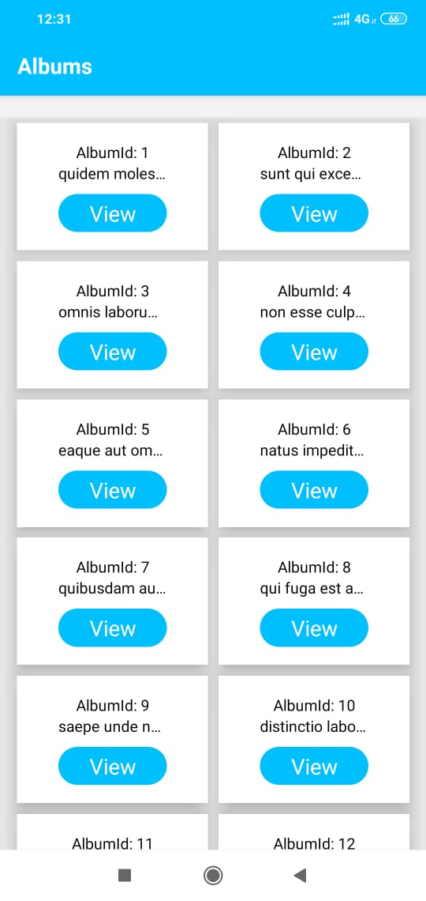
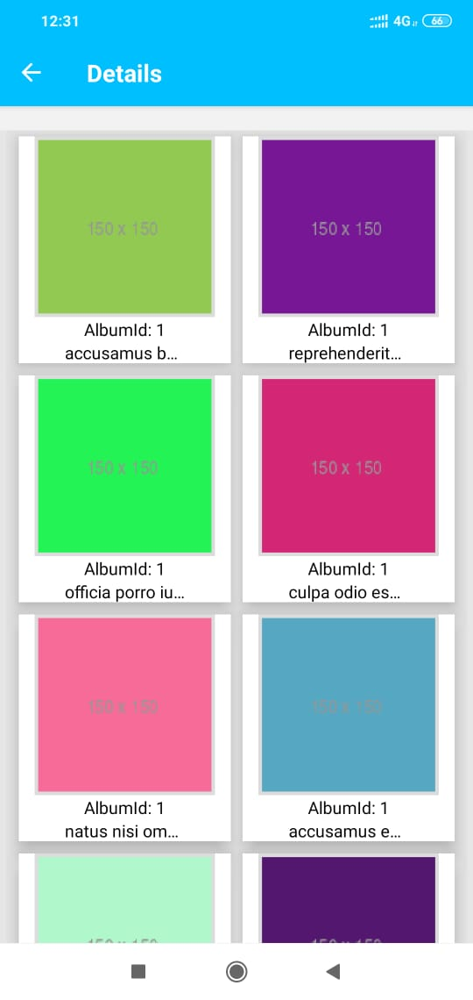
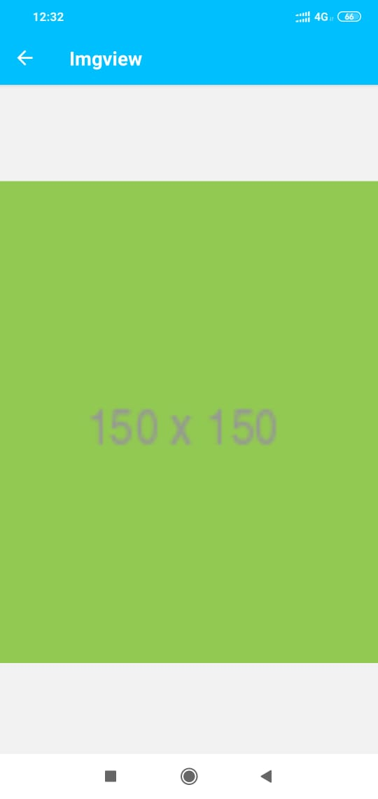

# React Native Photo Album App
  This is a sample Photo Album App built with React Native to build a mobile app.
#### Screens
      

#### Project Folder Structure
   - Expo-shared
   - __tests__
     - App.test.js
     - Imgview.test.js
     - List.test.js
     - Photos.test.js
   - assets
     - icon.png
     - splash.png
     - screen-1.jpeg
     - screen-2.jpeg
     - screen-3.jpeg
   - src
     - components
       - common
          - Header.js
       - Imgview.js
       - List.js
       - Photos.js
     - constants
       - Constants.js  
     - styles
       - Imgview.styles.js
       - List.styles.js
       - Photos.styles.js
   - App.js
   - app.json
   - babel.config.js
   - package-lock.json
   - README.md
   #### Clone & install
   - Clone this repo https://github.com/arun-devarasetti/photoAlbum.git
   - CD ProjectFolder
   - Run npm install
   - Run npm start
   #### Mobile Device
   - Scan QR code from mobile or Open explore tab, Press search and Enter url shown in terminal.
   - React and Expo versions
   - React: v16.9.0
   - Expo: v36.0.0
   
